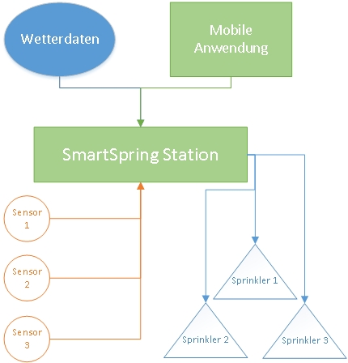

#SmartSpring Projekt
###Projektarbeit: KI und Wissensbasierte Systeme

____________________________________________________
___Autoren: Jasmin, Sinead, Danny___

+ ####Aufgabe:  
Mithilfe des Java Agent Development Framework(Jade) soll ein Software entwickelt werden.welche als Multi-Agenten-System ausgelegt sein soll und so autonom und "intelligent" wie möglich ihre Aufgaben erfüllen 

+ ####Idee: 
__Smart Spring: Ein intelligentes Bewässerungssystem__ 

+ ####Konzept:
Eine am Wasseranschluss installierte "Station" (*Hardware, Basisstation*) soll über Signale mit Sensoren kommunizieren. Diese Sensoren sollen den Feuchtigkeitszustand des Bodens messen, Übertragen und mögliche Fehler melden.
Die Feuchtigkeitswerte sollen, anhand vom Benutzer angegeben "Pflanzengruppe pro Sensor" (*benötigte Feuchtigkeit in Sensorumgebung*) ausgewertet und mit aktuellen, lokalen Wetterdaten(*Temperatur, Luftfeuchte, Regenwahrscheinlichkeit, Sonneneinstrahlung*) verglichen werden. Anschließend soll die Software eine Entscheidung über die zuzuführende Wassermenge  treffen. Bei kritischen Entscheidungen wird der Benutzer gefragt um Schäden an Pflanzen zu vermeiden.

####Quellen & Literatur

[http://www.iro.umontreal.ca/~vaucher/Agents/Jade/Bank/Bank-3-Gui/BankClientAgent.java](http://www.iro.umontreal.ca/~vaucher/Agents/Jade/Bank/Bank-3-Gui/BankClientAgent.java "Graphical User Interface with Jade")
 